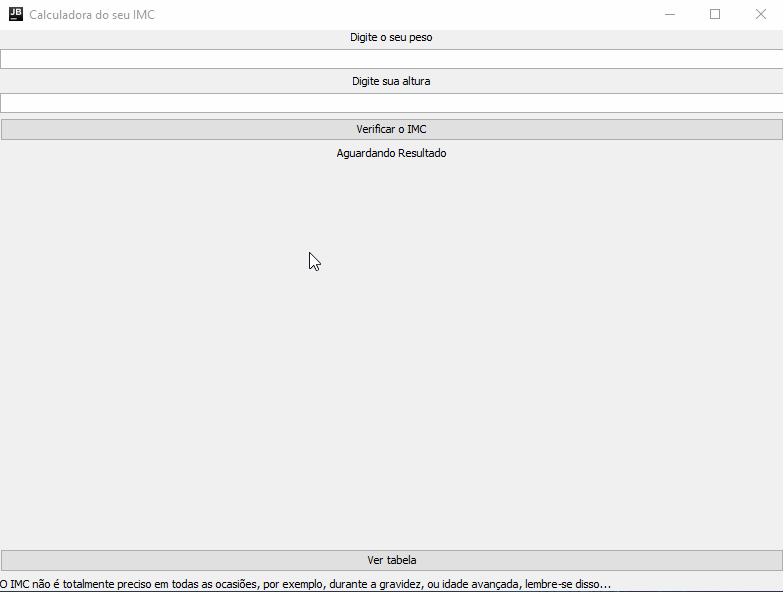
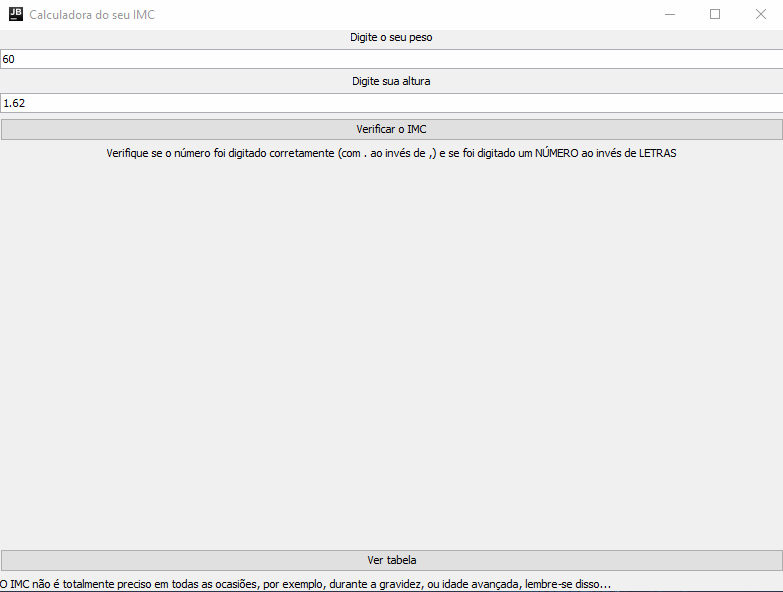
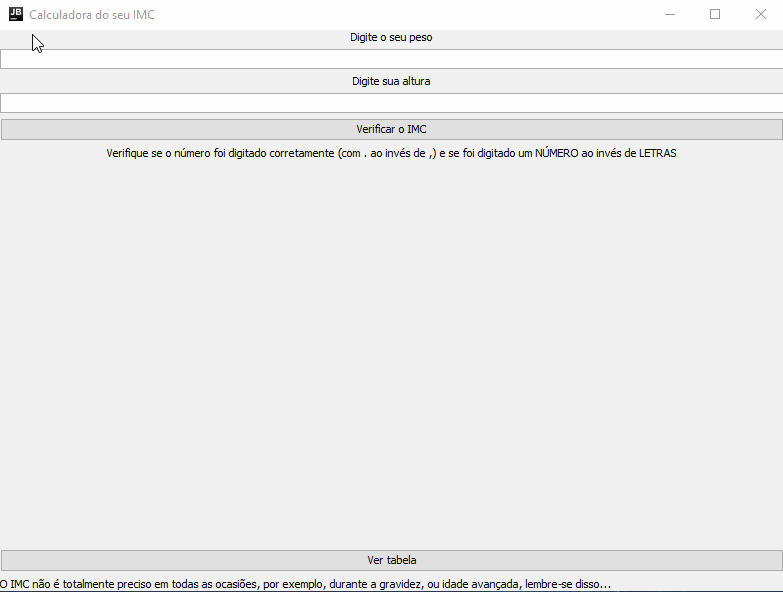

# Calculadora de IMC
## Sobre o projeto
### O que é IMC?
Pra as pessoas que não sabem o que é um IMC, 
o IMC é a sigla para Índice de Massa Corporal que serve para avaliar 
o peso do indivíduo em relação à sua altura e assim indicar se está dentro do peso ideal, acima ou abaixo do peso desejado.
### Mas qual é o objetivo desse programa?
O objetivo desse programa é facilitar a sua vida e fazer o cálculo e aparecer na tela o resultado,
claro que o cálculo na prática mesmo é fácil mas, é melhor assim não acha?
### Tá, mas como usa?
Simples demais! O IMC é baseado no peso e na altura né? Então, digite seu peso e altura 
e pressione o botão "Verificar o IMC", desse jeito, aparecerá na tela o resultado e pronto!
Veja por sí mesmo!

### Ok, mas e onde eu posso encontrar a tabela, na internet?
Não precisa, o programa também tem o sistema de ver a tabela na sua frente, ou sua tela
Veja só isso!

### Uma perguntinha! Pode digitar os números quebrados com vírgula?
Infelizmente não, a linguagem de programação que utilizei, só permite com . nessa situação
Quer que eu prove!? É pra já!

### É projeto acadêmico ou algo assim?
Não, fiz por diversão mesmo...
## Agradeço a vcs
* [Java](https://www.java.com/pt_BR/) - Linguagem de programação responsável pelo programa
* [IntelliJ IDEA](https://www.jetbrains.com/pt-br/idea/) - Minha IDE de Java preferida!
